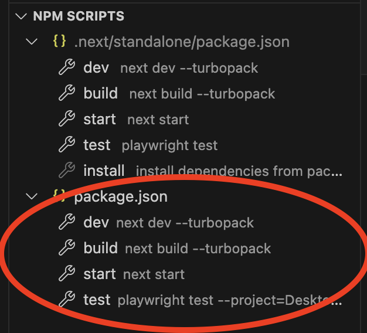

# verifier-plus

verifier-plus is a [Next.js](https://nextjs.org/) application providing two related, but fundamentally separate services:

* ***Credential Verification and Display*** - A web page for viewing and verifying [Verifiable Credentials](https://www.w3.org/TR/vc-data-model-2.0/).

* ***Online Credential Storage*** - server storage for Verifiable Credentials, to enable sharing a public link for a credential.

> [!NOTE]
> verifier-plus upports versions 1 and 2 of [Verifiable Credentials](https://www.w3.org/TR/vc-data-model-2.0/), including version 3 of [Open Badges](https://www.imsglobal.org/spec/ob/v3p0), but NOT version 2 of Open Badges.

>[!TIP]
>The [Digital Credentials Consortium](http://dcconsortium.org) runs an instance of this application at [verifierplus.org](https://verifierplus.org), but anyone is free to run their own instance elsewhere.

Let's talk a bit about the two services: credential verification and credential storage.

## Credential Verification

The landing page of VerifierPlus provides options for copy/pasting, uploading, linking to, or scanning a QR for a [Verifiable Credential](https://www.w3.org/TR/vc-data-model-2.0/). VerifierPlus displays a nicely formatted human-readable version of a credential, verifies the credential, and displays the results of verification.

The key idea with [Verifiable Credentials](https://www.w3.org/TR/vc-data-model-2.0/) is that we can on-the-spot check the cryptographic signature of a Verifiable Credential to confirm that the credential hasn't been tampered with since it was signed. A full explanation of all that this entails is available in the [Verifiable Credentials Specification](https://www.w3.org/TR/vc-data-model-2.0/).

Beyond the signature itself, we check a few other things, like that the credential hasn't expired, hasn't been revoked, and that it was in fact signed by a known issuer. A good place to read more about what we specificially check is our [verifier-core repository](https://github.com/digitalcredentials/verifier-core) which handles the underlying verification for both VerifierPlus and the [Learner Credential Wallet](lcw.app).

We've pre-generated some sample credentials [here](https://github.com/digitalcredentials/vc-test-fixtures/) that you can play with in our [running instance of VerifierPlus](https://verifierPlus.org). 

Each credential on the samples page has a QR that you can scan from VerifierPlus, a url that you can paste into the VerifierPlus text box, or the raw JSON that you can also paste into the VerifierPlus text box.

Here is one such credential to get you started. We've provided four options for opening it in VerifierPlus:

1. Open directly in VerifierPlus:

[Open it in VerifierPlus](https://verifierplus.org/#verify?vc=https://github.com/digitalcredentials/vc-test-fixtures/raw/refs/heads/main/verifiableCredentials/v2/ed25519/didKey/legacy-noStatus-noExpiry.json)

2. Scan QR from [VerifierPlus](https://verifierPlus.org):


3. Copy this link (which is the same link as in the QR) and paste it into the VerifierPlus text box:

[https://github.com/digitalcredentials/vc-test-fixtures/raw/refs/heads/main/verifiableCredentials/v2/ed25519/didKey/legacy-noStatus-noExpiry.json](https://github.com/digitalcredentials/vc-test-fixtures/raw/refs/heads/main/verifiableCredentials/v2/ed25519/didKey/legacy-noStatus-noExpiry.json)


<details>

<summary>4. Click here to see copyable raw json that you can copy/paste into VerifierPlus</summary>

```json
   {
    "@context": [
        "https://www.w3.org/ns/credentials/v2",
        "https://purl.imsglobal.org/spec/ob/v3p0/context-3.0.3.json",
        "https://w3id.org/security/suites/ed25519-2020/v1"
    ],
    "id": "http://example.com/credentials/3527",
    "type": [
        "VerifiableCredential",
        "OpenBadgeCredential"
    ],
    "issuer": {
        "id": "did:key:z6MknNQD1WHLGGraFi6zcbGevuAgkVfdyCdtZnQTGWVVvR5Q",
        "type": [
            "Profile"
        ],
        "name": "Example Corp"
    },
    "validFrom": "2010-01-01T00:00:00Z",
    "name": "Teamwork Badge",
    "credentialSubject": {
        "id": "did:example:ebfeb1f712ebc6f1c276e12ec21",
        "type": [
            "AchievementSubject"
        ],
        "achievement": {
            "id": "https://example.com/achievements/21st-century-skills/teamwork",
            "type": [
                "Achievement"
            ],
            "criteria": {
                "narrative": "Team members are nominated for this badge by their peers and recognized upon review by Example Corp management."
            },
            "description": "This badge recognizes the development of the capacity to collaborate within a group environment.",
            "name": "Teamwork"
        }
    },
    "proof": {
        "type": "Ed25519Signature2020",
        "created": "2025-01-09T17:58:33Z",
        "verificationMethod": "did:key:z6MknNQD1WHLGGraFi6zcbGevuAgkVfdyCdtZnQTGWVVvR5Q#z6MknNQD1WHLGGraFi6zcbGevuAgkVfdyCdtZnQTGWVVvR5Q",
        "proofPurpose": "assertionMethod",
        "proofValue": "z62t6TYCERpTKuWCRhHc2fV7JoMhiFuEcCXGkX9iit8atQPhviN5cZeZfXRnvJWa3Bm6DjagKyrauaSJfp9C9i7q3"
    }
}
```

</details>

You may well be wondering why anyone would ever want to deal with raw JSON code, and indeed that brings us to the second service that VerifierPlus provides:

## Online Credential Storage

A fundamental idea behind Verifiable Credentials is that they are standalone, autonomous, cryptographically signed declarations of some fact or facts. Verifiable Credentials are most simply just standard text (even the cryptographic signature is plain text), usually stored in files that the holder of the credential (like say a student with a Verifiable Credential copy of their degree) takes away with them and can keep forever, storing them wherever they like, without any dependency on the original issuer.

Most notably, the credentials do not have to be stored on a public server owned by an issuer (or a company acting on behalf of the issuer), and verification of the credentials can happen anywhere, anytime, without needing to make a call back to the original issuer or to any kind of online service that the issuer provides. This affords the credential holder significantly increased privacy, control and long-term ownership of their own credentials than if the credential verification runs back to the issuer.

However, because the credentials themselves are files, it can be difficult to manage them, and to share them with other people. So we usually encourage people to store their credentials in a so-called 'wallet' like our [Learner Credential Wallet](https://lcw.app) which consolidates the credentials in one place, in an app built specifically to help with things like receiving credentials, viewing credentials, verifying credentials, and sharing credentials.

 From within a wallet we can email, text message, AirDrop/QuickShare credentials, but even then it can be confusing for the receipient to know what to do with the file: how to view it and how to verify it. They can certainly do what we've described above and upload the file to VerifierPlus, but that takes some degree of understanding, and effort, and things can go wrong. During the copy/pasting for example, characters might get moved that affect the signature. And furthermore, we might even want to share our credendial more publicly with the world, which we of course can't feasibly do with email or text messages.

One answer to all of this is of course to put the file somewhere from which it can be publicly downloaded, like DropBox, Google Drive, Github, or really anywhere that provides a public link to the file, and then we can share that link widely, even posting it to our say our LinkedIn profile. But sharing files this way can be annoying to get the permissions right, to know how to upload a file, and for many people it's just not viable. 

Furthermore when we share the link to the file, whoever downloads it still has to know what to do with it, which can of course be a significant problem. Imagine, for example, if we are asked to upload proof of graduation to an online portal when say applying for a job. Whoever later reviews our application may well not know what to make of a file with JSON code in it.

Our approach, therefore, has been to provide a storage service for credentials that makes it easy to upload the credential directly from the Learner Credential Wallet, and at the same time generates a link for the credential that doesn't just return the credential, but opens the credential directly in VerifierPlus, instantly displaying and verifying the credential. The recipient of such a link doesn't see the JSON code at all, just the nicely formatted view of the credential and its verification details.

The Learner Credential Wallet also provides options making it easy to share that link with others either through email, messages, a QR code, or even by posting it to one's LinkedIn profile. 

The storage service itself is simply three API endpoints for storing, retrieving, and deleting a credential. You can find them in the [/app/api/credentials/route.ts](/app/api/credentials/route.ts) file.

The api endpoints save to a mongo backend, which you will have to setup. We've used Mongo Atlas ourselves, but you can of course use whatever Mongo setup you like.

When storing a credential with an intial POST of the credential to /api/credentials the server will put the credential into mongo and return a list of three urls, like so:

```JSON
 {
    "url": {
      // human-readable HTML view of the credential
      "view": "/credentials/{publicCredentialId}",
 
      // raw JSON GET (used by the html view)
      "get": "/api/credentials/{publicCredentialId}",
 
      // used for DELETE/unshare API
      "unshare": "/api/credentials/{publicCredentialId}"
    }
  }
 ```

The raw JSON for the credential can then be retrieved using the 'get', or removed from public view with 'unshare'. The 'view' url can be used to open the credential directly in VerifierPlus, where it will be verified and displayed in a nicely formatted view.

Worth noting is that the same effect as the 'view' url can be achieved with a credential that is stored somewhere else, simply by creating a url like so:

`https://verifierplus.org/#verify?vc=https://github.com/digitalcredentials/vc-test-fixtures/raw/refs/heads/main/verifiableCredentials/v2/ed25519/didKey/legacy-noStatus-noExpiry.json`

VerifierPlus knows to go fetch the credential, verify it, and display it in the rendered view.

## Local Development

Clone the repo then:

```
$ npm i
$ npm run dev
```

*This spins up a [dev server](http://localhost:3000) hosted at `http://localhost:3000`, which you can now open in a web browser.*

>[!WARNING]
>Make sure you run the right npm script. There are two sets of scripts, one in the package.json in the root directory and another in the .next/standalone/package.json directory. The latter is for running on the server, and if you run it locally it doesn't work properly. It is particularly easy to accidentally run the standalone script if you are working in Visual Code because the standalone scripts appear above the regular scripts in the VCode NPM Scripts tab. Make sure you run these:



The development server updates as you save changes to the underlying files.

Note that unless you've also configured a mongo backend as described in the [MongoDB](#mongodb) section below, then the credentials api endpoints won't work, but all verification should work as expected.

## MongoDB

Th credential storage part of VerifierPlus requires MongoDB for its backend storage. To set up MongoDB for this app:

 * create a Mongo Atlas cluster. 
 * from there create a collection, as well as a user with read and write permissions. 
 * copy `.env.example` to `.env` 
 * copy the connection details for your Atlas cluster into the appropriate fields in the `.env` file.

> [!TIP]
> If the app can't connect to your Mongo Atlas collection, make sure that you've added your server IP to the whitelist for your Mongo Atlas account.

## Docker

 We've provided both a sample Dockerfile and two sample docker compose files.

 The two docker compose files are identical except that the production version includes configuration for [nginxproxy/nginx-proxy](https://github.com/nginx-proxy/nginx-proxy) and [nginxproxy/acme-companion](https://github.com/nginx-proxy/acme-companion) to make it easier to run on your domain.

 Both compose files include a HEALTHCHECK configuration that monitors the running web app container. If the healthcheck returns 'unhealthy' three times in a row, the the [willfarrell/autoheal](https://github.com/willfarrell/docker-autoheal) service restarts the container.

 You can also configure an SMTP email server, which the healtcheck will use to send emails to an email recipient whose address you can also configure. The healthcheck only sends emails if the check returns unhealthy. 
 
 And finally you can set a webhook on both the healtcheck and the autoheal, to which the same notifications of unhealthy status will be sent. We use the Slack webhook for this.

 We've set the configuation values in the 'environment' sections of the compose file, but you can also use a .env file, like the .env.example we provide. The .env file may be more secure.

> [!TIP]
> If, when deploying to a different architecture, you get errors that seem related to tailwind, it may be that you need to include specific builds of the [lightningcss](https://lightningcss.dev) library, which [tailwind](https://tailwindcss.com) uses under the hood. The error should tell you which specific build is needed. You can then find the right package in npm and install it as an optionalDependency as we've already done for the linux build we needed for our AWS deployment: `npm i lightningcss-linux-x64-musl --save-optional`. You'll see in the optionalDependencies section of [package.json](./package.json) that we've also installed another build for an M4 Mac, `lightningcss-linux-arm64-musl`.

## Verifiable Presentation Request Exchange

 VerifierPlus provides an option on the landing page to request credentials from the Learner Credential Wallet.

 To use it you must set the NEXT_PUBLIC_EXCHANGE_SERVER_URL environment variable, pointing at the domain on which you run your instance of verifier-plus. 
 
 See [.env.example](./.env.example) for an example

## Testing

We use [Playwright](https://playwright.dev) for testing, pretty much as described on the excellent Playwright site, so we won't reproduce the Playwright documentation.

The basic idea, though, is that the playwright tests check a running server, which by default
is localhost, but can be set to any server by setting `PLAYWRIGHT_TEST_URL` in [.env.playwright](./.env.playwright), like so:

`PLAYWRIGHT_TEST_URL=https://stage.verifierplus.org`

This therefore allows us to run end to end tests on our local development server, on a staging server, or on a production server. Any running instance of verifier-plus.

You can also pass the value in on the command line if you like, e.g.,

`PLAYWRIGHT_TEST_URL=https://stage.verifierplus.org npm run test`

Note too that you can set which browsers you'd like to run the tests on using the --project flag as described in this [Playwright doc](https://playwright.dev/docs/running-tests#run-tests-on-different-browsers). Note that you'll have to have defined the projects in the [playwright.config.ts](./playwright.config.ts).

>[!NOTE]
>We've set a fairly relaxed maxDiffPixels and maxDiffPixelRatio in [playwright.config.ts](./playwright.config.ts) for the screenshot matching because our tests were failing because of inconsequential differences between the images. You may want to change those if need be.

>[!TIP]
>If for whatever reason you don't want to set the playwright PLAYWRIGHT_TEST_URL as an environment variable you can of course also directly change the baseURL in [playwright.config.ts](./playwright.config.ts).


## Next.js

To learn more about Next.js, take a look at the following resources:
- [Next.js Documentation](https://nextjs.org/docs) - learn about Next.js features and API.
- [Learn Next.js](https://nextjs.org/learn) - an interactive Next.js tutorial.

